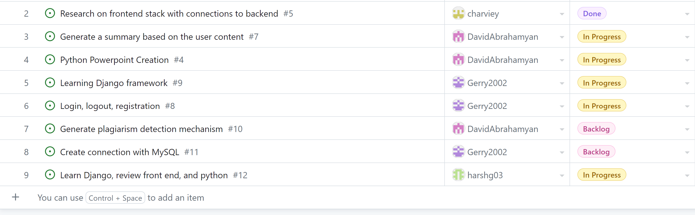

# Charvie Yadav (89136931) Individual Logs

## Week5 (Oct.2, 2023 - Oct.8, 2023)

### Goals Recap
- My goal this week was to learn the Django framework and to set up and integrate the project folder locally so that we can begin coding.

### Tasks on board

### Completed vs InProgress
- The inprogress work is to just finish learning Django and start the frontend work with the login page, homepage and rest of the features. Additionally, I had completed some research on the frontend and backend connections but that was taken over with our decision to use Django.

## Week4 (Sept.25, 2023 - Oct.1, 2023)

### Goals Recap
- My goal this week was to help complete the project plan as well as research the basic frontend stack required for our project to help the other team members.

### Tasks on board
- I helped organize the Kanban Board, helped complete the project plan (specifically milestones).

### Completed vs InProgress
- Project planning is fully completed. We will be finalizing the frontend stack and completing review on that topic then proceed to implementing our next feature which is the homepages.

### Context

- This week will set everything in stone and give each one of us mor clarity on our project as we brainstormed ideas on features during our standup meetings. We will be more in action with our plan.

### Peer eval

