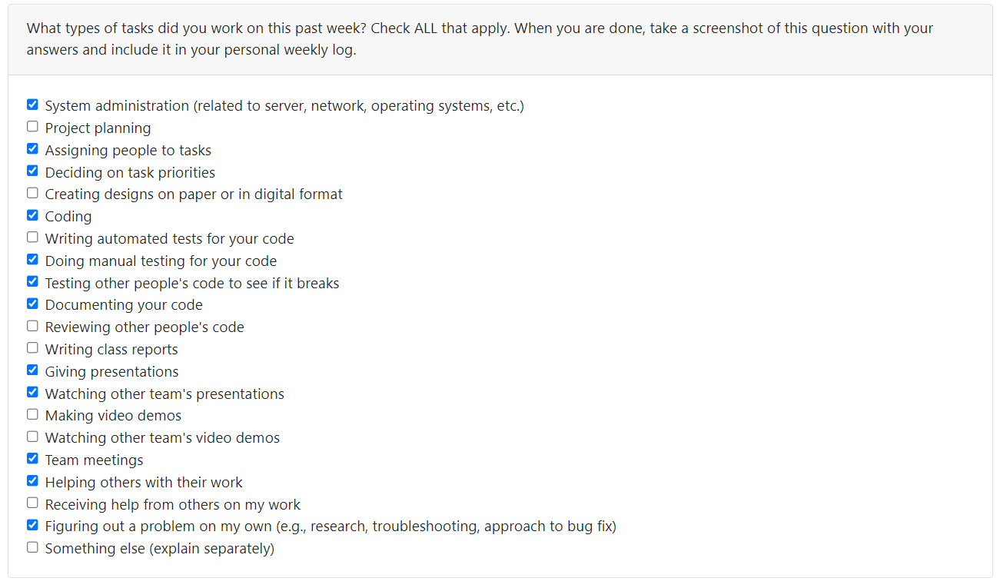
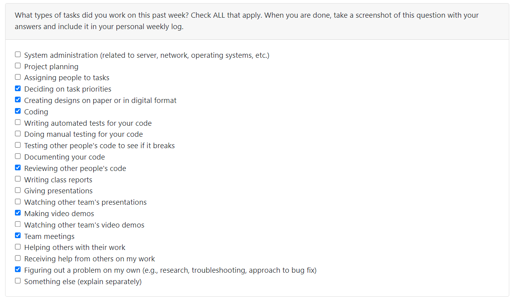
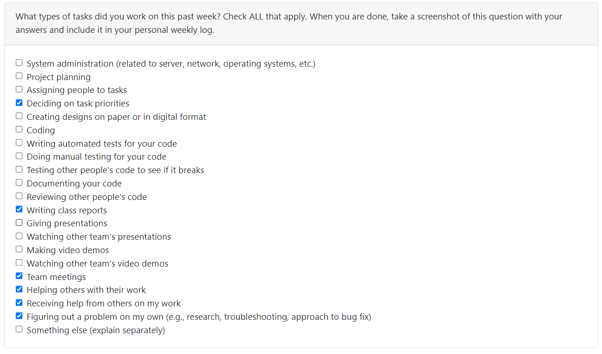
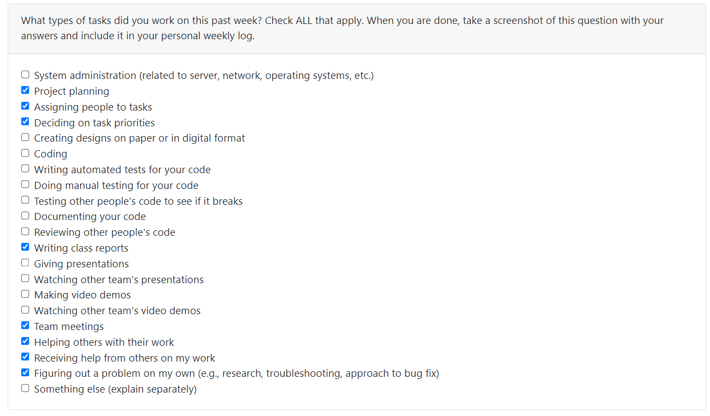
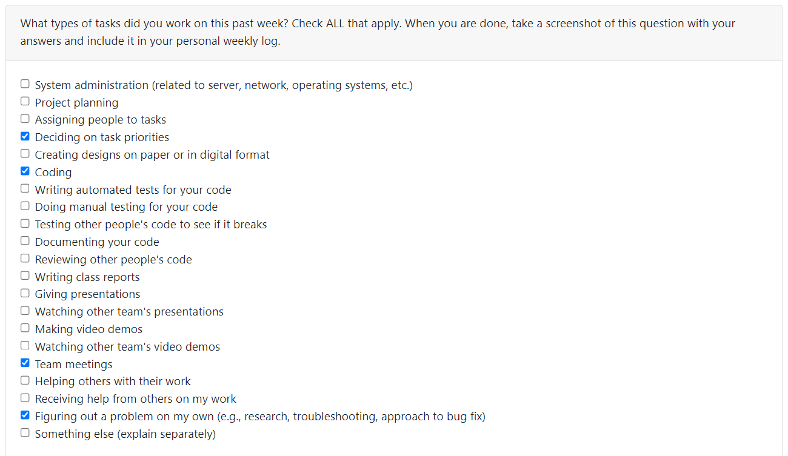
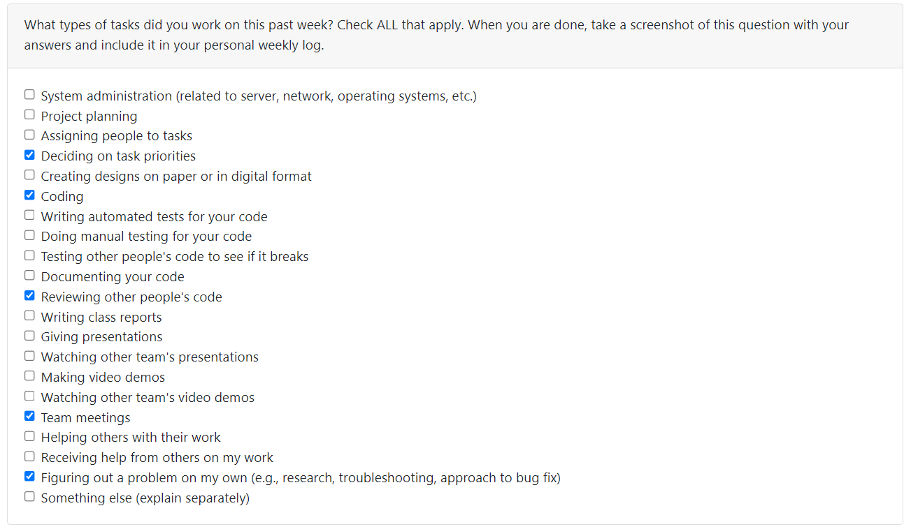
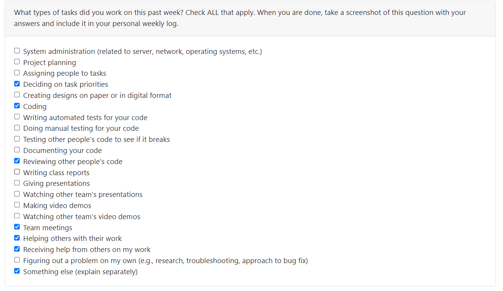
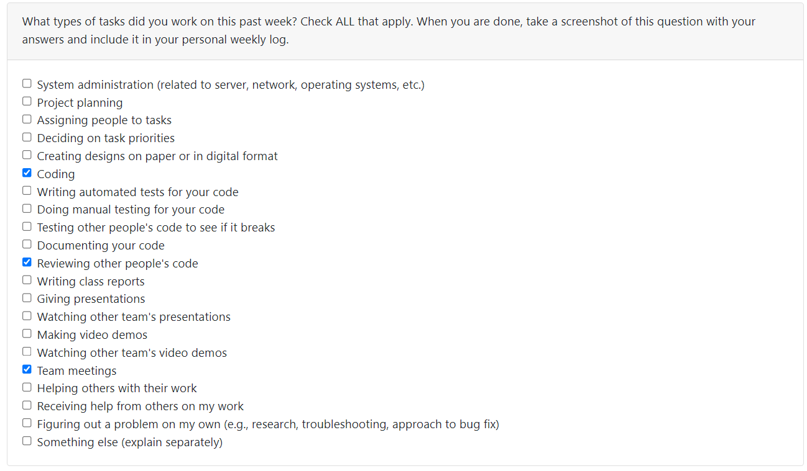

# Charvie Yadav (89136931) Individual Logs

## Week 1 Term 2

### Work period
- Jan.8, 2024 - Jan.14, 2024

### Goals Recap
- My goals for this week was to settle into the new term and plan out with my team what was expected and decide on how to go ahead with our project. I also set personal goals for myself i.e. allocating number of hours per week that I will work on the capstone.

### Tasks on board
- The tasks I will work on is planning out the homepage design (associated task on Kanban Board: Homepage - quote changer animation), and finish making the website responsive for different devices (associated task on Kanban Board: Make website responsive).

### Completed vs InProgress
- I am currently working on making the website fully responsive. The tasks I will work on next is planning out the homepage design (associated task on Kanban Board: Homepage - quote changer animation).

### Context
-  Overall it was a productive week and I learned new planning and management tools in class.

## Week9 (Oct.30, 2023 - Nov. 5, 2023)

### Goals Recap
- My goals for this week was to fix changes to the front end and work on new frontend features.

### Tasks on board
- I made the entire website responsive now and worked on creating the about us page that is in review.

### Completed vs InProgress
-  Successfully completed the presentation. Completed working on responsiveness and new page (both are under review).

### Peer eval

## Week8 (Oct.23, 2023 - Oct.29, 2023)

### Goals Recap
- My goals for this week was to complete working for the presentation and work on making sure the frontend was ready for MVP.

### Tasks on board
- Task on board was nothing in particular, apart from fixing issues in frontend before the presentation.

### Completed vs InProgress
-  All tasks/featues were completed for the MVP

### Peer eval

## Week7 (Oct.16, 2023 - Oct.22, 2023)

### Goals Recap
- My goal for the week was to complete the profile page creation 

### Tasks on board
- My task on board was listed as "Profile Page"

### Completed vs InProgress
- The Profile Page creation is completed with edit profile, create profile page options and the inprogress tasks is to make the website responsive.

## Week6 (Oct.9, 2023 - Oct.15, 2023)

### Goals Recap
- My goal for the week was to complete the frontend of the website and the overall look

### Tasks on board
- My task on board was listed as "frontend for homepage, login, registration"

### Completed vs InProgress
- The frontend for homepage, login, registration is completed and the inprogress task is the profile page creation.

### Peer eval

## Week5 (Oct.2, 2023 - Oct.8, 2023)

### Goals Recap
- My goal this week was to learn the Django framework and to set up and integrate the project folder locally so that we can begin coding.

### Tasks on board
- Task on board was called "learn django, review frontend and python"

### Completed vs InProgress
- The inprogress work is to just finish learning Django and start the frontend work with the login page, homepage and rest of the features. Additionally, I had completed some research on the frontend and backend connections but that was taken over with our decision to use Django.

### Peer eval

## Week4 (Sept.25, 2023 - Oct.1, 2023)

### Goals Recap
- My goal this week was to help complete the project plan as well as research the basic frontend stack required for our project to help the other team members.

### Tasks on board
- I helped organize the Kanban Board, helped complete the project plan (specifically milestones).

### Completed vs InProgress
- Project planning is fully completed. We will be finalizing the frontend stack and completing review on that topic then proceed to implementing our next feature which is the homepages.

### Context

- This week will set everything in stone and give each one of us mor clarity on our project as we brainstormed ideas on features during our standup meetings. We will be more in action with our plan.

### Peer eval

## Week 2 Term 2

### Work period
- Jan.15, 2024 - Jan.21, 2024

### Goals Recap
- My goals for this week was to work on the homepage for the website.

### Tasks on board
- The current task that I worked on was implementing the homepage (associated task on Kanban Board: Homepage - quote changer animation).

### Completed vs InProgress
-   I worked on implementing the homepage and merging contact and about page in the main homepage, including working on frontend and backend to send forms in php. I am still debugging the page to fix issues with loading images on error.

### Context
-  This week I felt more on track as I eased my way into the term and I feel more productive than I did before. Our team has a solid plan that we are currently implementing

## Week 3 Term 2

### Work period
- Jan.22, 2024 - Jan.28, 2024

### Goals Recap
- My goals for this week was to finish implementing the homepage, debug and start working on the design of the chat functionality.

### Tasks on board
- The current task that I worked on was debug my previous code (associated task on Kanban Board: Remove raw edit password in edit profile).

### Completed vs InProgress
-  The completed task is the homepage, which was a large PR. The inprogress tasks are removing raw edit password in edit profile and still trying to debug other parts of frontend i.e contact page, homepage etc. 

### Context

-  This week really helped me get back on track with development and visualizing the work I need to do in the upcoming week such as the chat functionality design.

### Peer eval

## Week 4 Term 2

### Work period
- Jan.29, 2024 - Feb.04, 2024

### Goals Recap
- My goals for this week was to finish debugging my code for other parts of the frontend and prepare for peer testing. After peer testing was completed, I have also been working on the chat functionality design.

### Tasks on board
- The current task that I am working on is chat functionality design (associated task on Kanban Board: chat functionality design)

### Completed vs InProgress
-  The completed task is chat functionality although I'm still waiting on PR approval, which was a large PR. I also finished removing raw edit password in edit profile and debugging other parts of frontend i.e contact page, homepage etc. I will continue develop frontend of upcoming features.

### Peer eval

## Week8 

### Work period
- Feb 26, 2024 - Mar 03, 2024
### Goals Recap
- My goal for this week was to start working on transtions and animations on the homepage and finish up on the light mode implementation of the website.

### Tasks on board
- The current task that I worked on was implementing dark-light mode design for the website (associated task on Kanban Board: light-dark mode implementation), and decided with Charvie that she will do a part of it, as well as worked exercise and adapted content generation loading page (associated task on Kanban Board: Exercise generation loading page and Adapted content generation loading page)

### Completed vs InProgress
- I completed chat functionality design (this was continuing as we decided to merge open chat features into the main chat page), completed creating the favicon logo and fixing image not loading with static images, fixed image sizes on homepage (personal PR), and completed the light mode of the website (in review). I am currently still working on the transitions and animations of the page.

### Context

-  It was a very productive week with a lot of different things to work on. Since each member has many things to merge, I am waiting for that to happen so I can complete my transitions on images as the branch currently does not have proper loading images. 

### Peer eval

## Week9 (Feb 04, 2024 - Mar 10, 2024)
### Goals Recap
- The goal for this week was to debug light mode of website and transitions on homepage, and start working on building basic animations to make the website dynamic. We also had peer testing which gave us important feedback.

### Tasks on board
- My tasks are to work on creating animations and redesign the open chat feature that leads into the main chat functionality as currently its taking the default bootstrap theme.

### Completed vs InProgress
- There is a PR currently under review for transitions on homepage and light mode is completed. 

### Context
- This week our team made progress by implementing a main chunk of our website. From the frontend side, I will be adding more features to make the website look and feel better. Peer testing really helped me find bugs in my code and I will also begin fixing those in the upcoming week.

### Peer eval

## Week10 (Mar 11, 2024 - Mar 17, 2024)
### Goals Recap
- The goal for this week was to add more features to make the website look better, and fix bugs. I redesigned the open chat feature completely and made changes to the actual chat page, implementing dark mode as well. I added some UI components to the FAQ page. I've fixed all frontend bugs identified in the peer testing. 

### Tasks on board
- I am currently in progress of adding animations to make the website less static. All the other tasks are completed or in review: #151 Bug fixing from peer testing and #141 Open Chat Redesign.

### Completed vs InProgress
- The in review tasks are majorly completed. The in progress task is #139 Animations, which is something I'm trying to figure out as it's tricky to fit in with the Django framework.  

### Context
- I believe a major chunk of the frontend was completed this week and there is not much to add onto the current aesthetic. I will be discussing with my team in the weekly meeting to brainstorm final ideas to add onto our website.

### Peer eval

