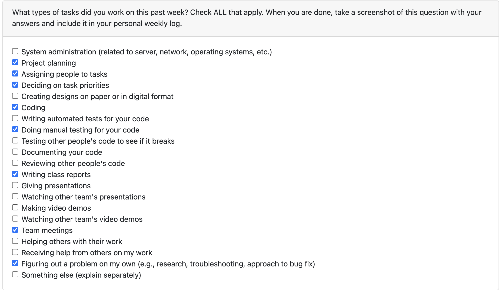
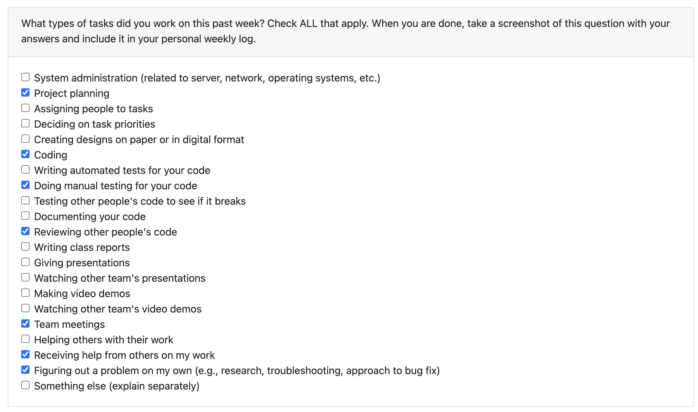
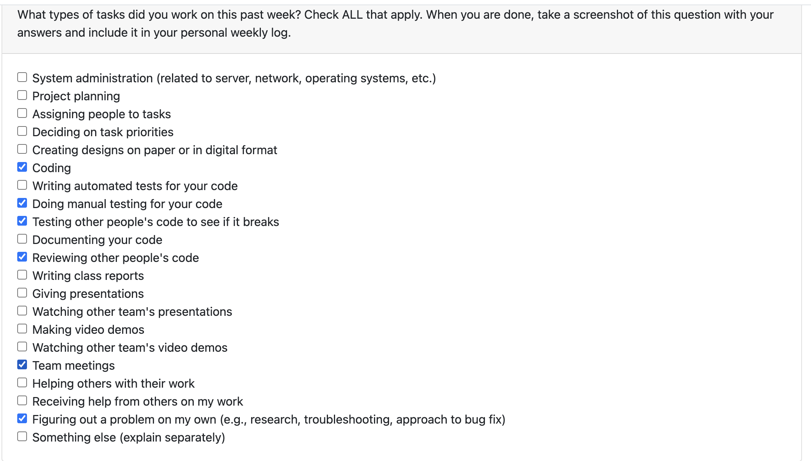
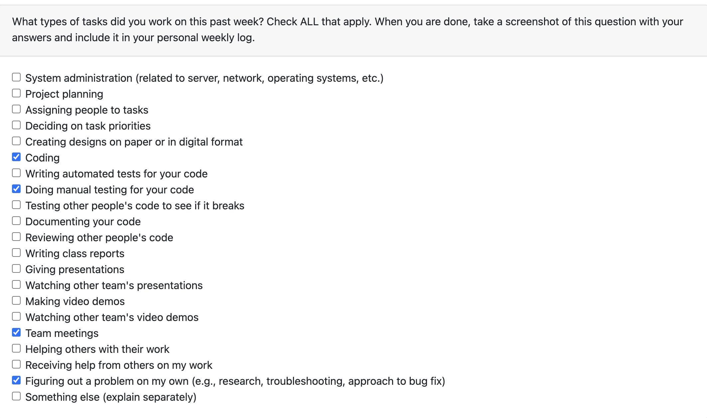
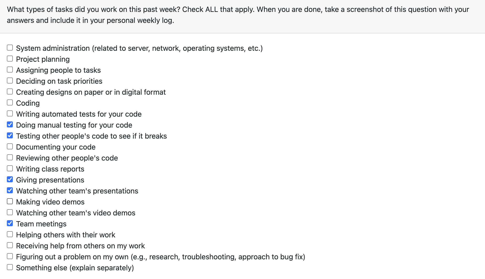
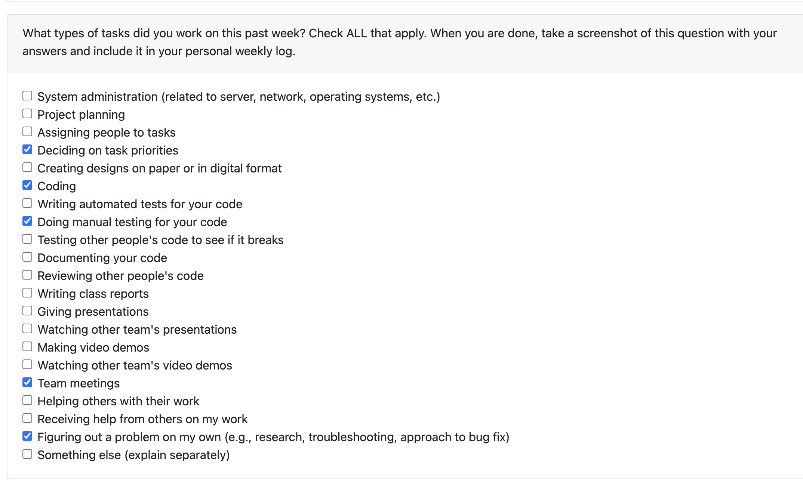
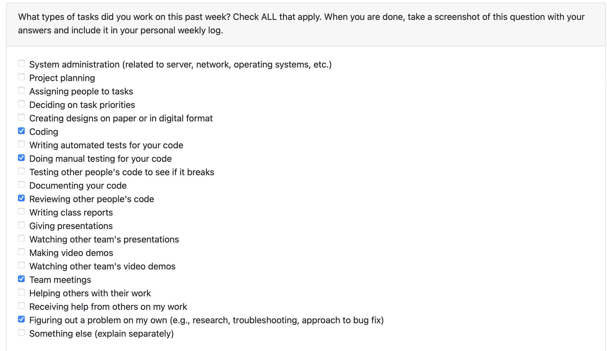

# Davit Abrahamyan (36173516) Individual Logs

## Week4 (Sept.25, 2023 - Oct.1, 2023)

### Goals Recap
- My goals for this week was to complete tech stack as well as try to complete the task of generating presentations based on the user prompt

### Tasks on board
- I completed the tech stack of the project planning (name of assosicated task on Kanban: Project Plan) as well as wrote a functioning code in python that takes an input the user prompt and generates and outputs a power point presentation file (name of task on Kanban: Python PowerPoint Creation).

### Completed vs InProgress
- Project planning is fully completed. The code is fully functioning, only refactoring and cleansing is remaining.

### Context

- This was an important week which helped us to make sure that everyone in the team is on the same track. Major features were identified and prioritized and everyone came to a consensus regarding the overall structure and fucntionalities that the project will include.

### Peer eval

## Week5 (Oct.2, 2023 - Oct.8, 2023)

### Goals Recap
- My goals for this week was to complete the task of generating presentations based on the user prompt, complete the task of generating a summary based on the user content, as well as start learning django and setup our project envioronment on my computer.

### Tasks on board
- I completed generating presentations based on the content (name of assosicated task on Kanban: Python Powerpoint Creation) as well as generating summary based on the user content (name of task on Kanban: Generate a summary based on the user content). I am currently doing the research on Django and in the process of setting up the project environment locally on my computer (name of task on Kanban: Learn Django, setup our project environment locally).

### Completed vs InProgress
- Presentation generation and summary generation is fully completed (as a separate file) and the only remaining thing is to add it to the whole project. The django research and setting up the project locally is in progress.

### Context

- This week was helful in terms of getting started with the project overall and setting up the development environment. It was also productive, as some of the main features of the project were implemented.

### Peer eval

## Week6 (Oct.9, 2023 - Oct.15, 2023)

### Goals Recap
- My goals for this week was to complete the task of creating plagiarism detection mechanism based on the uploaded files as well as do some refactoring on presentation and summary generation.

### Tasks on board
- I completed creating plagiarism detection mechanism (name of associated task on Kanban: generate Plagiarism Detection Mechanism) as well as did some refactoring for presentation generation and summary generation. 

### Completed vs InProgress
- Both refactoring and plagiarism detection mechanism are fully complete.

### Context

- This week was helpful in terms of making the overall code cleaner and more understandable for others to review it. It was also productive, as one of the main features of the project  (plagiarism detection)  was implemented.

### Peer eval

## Week7 (Oct.16, 2023 - Oct.22, 2023)

### Goals Recap
- My goals for this week was to complete the task of generating exercises based on the user provided prompt or uploaded files as well as start implementing a basic virtual assistant (chatbot) for our website.

### Tasks on board
- I completed exercise generation task (name of associated task on Kanban: Practice Exercise Generation) as well as started implementing the virtual assistant. 

### Completed vs InProgress
-  The exercise generation task is fully complete and is under code review and the virtual assistant implementation in currently in progress.

### Context

-  It was a productive week, as one of the main features of the project  (exercise generation)  was implemented and the initial steps towards creating the virtual assistant were done.

### Peer eval

## Week8 (Oct.23, 2023 - Oct.29, 2023)

### Goals Recap
- My goals for this week was to complete the implementation of a basic virtual assistant (chatbot) for our website.

### Tasks on board
- I completed implementing the virtual assistant (name of associated task on Kanban: Generate virtual assistant (chatbot) for the website). 

### Completed vs InProgress
-  The virtual assistant creation task is fully complete and is under code review. Currently, no task in progress.

### Context

-  It was a productive week, as a very useful and important feature of the project  (virtual assistant)  was implemented.

### Peer eval

## Week9 (Oct.30, 2023 - Nov. 5, 2023)

### Goals Recap
- My goals for this week was to prepare for the mini-presentation.

### Tasks on board
- There were no specific tasks on board on which I worked. I tested overall system to see if it breaks and prepared for the presentation.

### Completed vs InProgress
-  Successfully completed the presentation. Will start working on adaptive student material generation.

### Context

-  It was a productive week, mini-presentations were done successfully. It was very helpful in terms of looking at other team's presentations as well as receiving feedback from them.

### Peer eval

## Week10 (Nov. 6, 2023 - Nov. 12, 2023)

### Goals Recap
- My goals for this week was to prepare start working on adapting educational materials from one age group into another. There was a priority shift in the tasks. This task went back to backlog and I started working on incorporating images into presentation generation.

### Tasks on board
- I worked on incorporating images into presentation generation (associated task on Kanban: Add images to presentation generation).

### Completed vs InProgress
-  The task on Adaptive education material went back to backlog. Adding images to presentation generation is in progress.

### Context

-  It was a productive week as we identified our priorities for now and the tasks changed accordingly.

### Peer eval

## Week11 (Nov. 13, 2023 - Nov. 19, 2023)

### Goals Recap
- My goals for this week was add images to Presentation Generation.

### Tasks on board
- The name of the associated task on the Kanban Board was "Add Images to Presentation Generation"

### Completed vs InProgress
-  Successfully completed the presentation generation with images. The work in progress is refactoring the code according to the recent update in Python openai library.

### Context

-  It was a productive week as the generated presentations are now more entertaining for the user

### Peer eval

## Week12 (Nov. 20, 2023 - Nov. 26, 2023)

### Goals Recap
- My goals for this week were code refactoring based on the latest openai library update.

### Tasks on board
- I worked on refactoring the code (associated task on Kanban: Code Refactoring).

### Completed vs InProgress
-  The Code Refactoring task is fully completed and the code is fully functional. The current task that is in progress is adapting educational materials from one age group to another (associated task on Kanban Board: adaptive educational materials).

### Context

-  It was a productive week the code was refactored, and now we are up-to-date with the latest updated in the openai library.

### Peer eval

