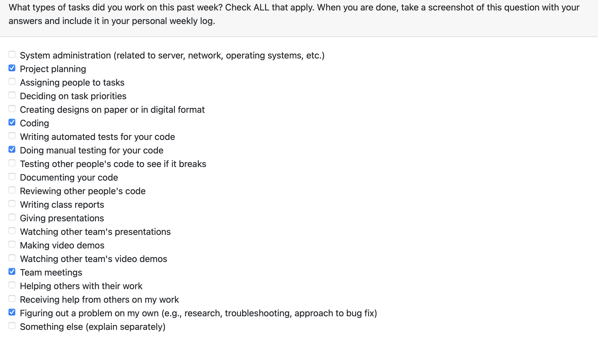

# Davit Abrahamyan (36173516) Individual Logs

## Week4 (Sept.25, 2023 - Oct.1, 2023)

### Goals Recap
- My goals for this week was to complete tech stack as well as try to complete the task of generating presentations based on the user prompt

### Tasks on board
- I completed the tech stack of the project planning (name of assosicated task on Kanban: Project Plan) as well as wrote a functioning code in python that takes an input the user prompt and generates and outputs a power point presentation file (name of task on Kanban: Python PowerPoint Creation).

### Completed vs InProgress
- Project planning is fully completed. The code is fully functioning, only refactoring and cleansing is remaining.

### Context

- This was an important week which helped us to make sure that everyone in the team is on the same track. Major features were identified and prioritized and everyone came to a consensus regarding the overall structure and fucntionalities that the project will include.

### Peer eval

## Week5 (Oct.2, 2023 - Oct.8, 2023)

### Goals Recap
- My goals for this week was to complete the task of generating presentations based on the user prompt, complete the task of generating a summary based on the user content, as well as start learning django and setup our project envioronment on my computer.

### Tasks on board
- I completed generating presentations based on the content (name of assosicated task on Kanban: Python Powerpoint Creation) as well as generating summary based on the user content (name of task on Kanban: Generate a summary based on the user content). I am currently doing the research on Django and in the process of setting up the project environment locally on my computer (name of task on Kanban: Learn Django, setup our project environment locally).

### Completed vs InProgress
- Presentation generation and summary generation is fully completed (as a separate file) and the only remaining thing is to add it to the whole project. The django research and setting up the project locally is in progress.

### Context

- This week was helful in terms of getting started with the project overall and setting up the development environment. It was also productive, as some of the main features of the project were implemented.

### Peer eval

## Week6 (Oct.9, 2023 - Oct.15, 2023)

### Goals Recap
- My goals for this week was to complete the task of creating plagiarism detection mechanism based on the uploaded files as well as do some refactoring on presentation and summary generation.

### Tasks on board
- I completed creating plagiarism detection mechanism (name of associated task on Kanban: generate Plagiarism Detection Mechanism) as well as did some refactoring for presentation generation and summary generation. 

### Completed vs InProgress
- Both refactoring and plagiarism detection mechanism are fully complete.

### Context

- This week was helpful in terms of making the overall code cleaner and more understandable for others to review it. It was also productive, as one of the main features of the project  (plagiarism detection)  was implemented.

### Peer eval

## Week7 (Oct.16, 2023 - Oct.22, 2023)

### Goals Recap
- My goals for this week was to complete the task of generating exercises based on the user provided prompt or uploaded files as well as start implementing a basic virtual assistant (chatbot) for our website.

### Tasks on board
- I completed exercise generation task (name of associated task on Kanban: Practice Exercise Generation) as well as started implementing the virtual assistant. 

### Completed vs InProgress
-  The exercise generation task is fully complete and is under code review and the virtual assistant implementation in currently in progress.

### Context

-  It was a productive week, as one of the main features of the project  (exercise generation)  was implemented and the initial steps towards creating the virtual assistant were done.

### Peer eval

## Week8 (Oct.23, 2023 - Oct.29, 2023)

### Goals Recap
- My goals for this week was to complete the implementation of a basic virtual assistant (chatbot) for our website.

### Tasks on board
- I completed implementing the virtual assistant (name of associated task on Kanban: Generate virtual assistant (chatbot) for the website). 

### Completed vs InProgress
-  The virtual assistant creation task is fully complete and is under code review. Currently, no task in progress.

### Context

-  It was a productive week, as a very useful and important feature of the project  (virtual assistant)  was implemented.

### Peer eval

## Week9 (Oct.30, 2023 - Nov. 5, 2023)

### Goals Recap
- My goals for this week was to prepare for the mini-presentation.

### Tasks on board
- There were no specific tasks on board on which I worked. I tested overall system to see if it breaks and prepared for the presentation.

### Completed vs InProgress
-  Successfully completed the presentation. Will start working on adaptive student material generation.

### Context

-  It was a productive week, mini-presentations were done successfully. It was very helpful in terms of looking at other team's presentations as well as receiving feedback from them.

### Peer eval

## Week10 (Nov. 6, 2023 - Nov. 12, 2023)

### Goals Recap
- My goals for this week was to prepare start working on adapting educational materials from one age group into another. There was a priority shift in the tasks. This task went back to backlog and I started working on incorporating images into presentation generation.

### Tasks on board
- I worked on incorporating images into presentation generation (associated task on Kanban: Add images to presentation generation).

### Completed vs InProgress
-  The task on Adaptive education material went back to backlog. Adding images to presentation generation is in progress.

### Context

-  It was a productive week as we identified our priorities for now and the tasks changed accordingly.

### Peer eval

## Week11 (Nov. 13, 2023 - Nov. 19, 2023)

### Goals Recap
- My goals for this week was add images to Presentation Generation.

### Tasks on board
- The name of the associated task on the Kanban Board was "Add Images to Presentation Generation"

### Completed vs InProgress
-  Successfully completed the presentation generation with images. The work in progress is refactoring the code according to the recent update in Python openai library.

### Context

-  It was a productive week as the generated presentations are now more entertaining for the user

### Peer eval

## Week12 (Nov. 20, 2023 - Nov. 26, 2023)

### Goals Recap
- My goals for this week were code refactoring based on the latest openai library update.

### Tasks on board
- I worked on refactoring the code (associated task on Kanban: Code Refactoring).

### Completed vs InProgress
-  The Code Refactoring task is fully completed and the code is fully functional. The current task that is in progress is adapting educational materials from one age group to another (associated task on Kanban Board: adaptive educational materials).

### Context

-  It was a productive week the code was refactored, and now we are up-to-date with the latest updated in the openai library.

### Peer eval

## Week13 (Nov. 27, 2023 - Dec. 3, 2023)

### Goals Recap
- My goals for this week was to work on the Design milestone with the team and finilize it.

### Tasks on board
- The current task that is in progress is adapting educational materials from one age group to another (associated task on Kanban Board: adaptive educational materials). I will continue working on it this week

### Completed vs InProgress
-  I worked on making the presentation slides as well as the video for the Design Milestone. The current task that is in progress is adapting educational materials from one age group to another (associated task on Kanban Board: adaptive educational materials).

### Context

-  It was a productive week as we worked on and completed the design milestone which helped us to make sure that we are all on the same and correct track.

### Peer eval

## Week 1 Term 2

### Work period
- Jan.8, 2024 - Jan.14, 2024

### Goals Recap
- My goals for this week was to get started with new term, see what was expected from us, have a meeting with the team and work on improving the project

### Tasks on board
- The current task that I worked on was implementing helper icons (associated task on Kanban Board: Helpers for different functionalities). The other task is the adapted content generation (associated task on Kanban Board: adaptive educational materials)

Github commit for helper icons - https://github.com/COSC-499-W2023/year-long-project-team-17/commit/d2b5b7635748b3ac34d8aeae30ed1fc6c25d2264
### Completed vs InProgress
-  I worked on and successfully implemented the helper icons for different functionalities (associated task on Kanban Board: Helpers for different functionalities). Currently, I am working on implementing the adaptive content generation functionality (Associated task on Kanban Board: adaptive educational materials).

### Context

-  It was a productive week as we got started with the new term as well as discussed our future plans for the project.

### Peer eval

## Week 2 Term 2

### Work period
- Jan.15, 2024 - Jan.21, 2024

### Goals Recap
- My goals for this week was to implement adapted content generation

### Tasks on board
- The current task that I worked on was implementing the adapted content generation (associated task on Kanban Board: adaptive educational materials)
-github commit for adapted content generation - https://github.com/COSC-499-W2023/year-long-project-team-17/commit/11d2547668d700b9c104123290b7d4f22c25ddc0
### Completed vs InProgress
-  I worked on and successfully implemented  the adaptive content generation functionality (Associated task on Kanban Board: adaptive educational materials). Currently, I am working on implementing loading page for presentation generation

### Context

-  It was a productive week as I was able to implement one of the tasks and get started with another one.

### Peer eval

## Week 3 Term 2

### Work period
- Jan.22, 2024 - Jan.28, 2024

### Goals Recap
- My goals for this week was to start working on the loading page implementation

### Tasks on board
- The current task that I worked on was implementing the loading page (associated task on Kanban Board: Loading page)

### Completed vs InProgress
-  I worked on the loading page implementation (Associated task on Kanban Board: Loading Page). Currently, I continue to work on that as I have not finished it. Also, I have resolved merge conflicts with helper_icons branch and adaptive_content_generation branch. I also modified the button styles on the home page to be consistent with the rest of the pages.

### Context

-  It was a productive week as I was able to resolve all of the merge conflicts that we had and also get started with the loading page which is really essential for the overall user experience.

### Peer eval

## Week 4 Term 2

### Work period
- Jan.29, 2024 - Feb.04, 2024

### Goals Recap
- My goals for this week was to finalize implementing loading page and get ready for the peer testing

### Tasks on board
- The current task that I worked on was implementing the loading page (associated task on Kanban Board: Loading page)

### Completed vs InProgress
-  I worked on the loading page implementation and finalized it(Associated task on Kanban Board: Loading Page). Currently, I am working on updating the frontend of our pages to make them more visually appealing and eye-catching for the user (Associated Task on Kanban Board: Update Frontend)

### Context

-  It was a productive week as I was able to resolve implement the loading page. Moreover, we got a useful feedback from our peers, which will help us to further improve our website.

### Peer eval

## Week 5 Term 2

### Work period
- Feb.05, 2024 - Feb.11, 2024

### Goals Recap
- My goals for this week was start working on updating the frontend of our website as well as resolving some bugs

### Tasks on board
- The current task that I worked on was Updating frontend (associated task on Kanban Board: Update frontend) as well as fixing the broken image issue (associated task on Kanban Board: Resolve broken image issue)

### Completed vs InProgress
-  I worked on the updating the frontend and updated the design of most of the pages (except the login page as well as the virtual assistant page) as well as successfully resolved the broken image issue (github branch name: updated_frontend).

### Context

-  It was a productive week as I was able to update the UI of the most of the pages as well as resolve the broken image issue.

### Peer eval

## Week 6 Term 2

### Work period
- Feb.12, 2024 - Feb.18, 2024

### Goals Recap
- My goals for this week was to start working on light-dark mode implementation

### Tasks on board
- The current task that I worked on was implementing dark-light mode design for the website (associated task on Kanban Board: light-dark mode implementation)

### Completed vs InProgress
-  I worked on the initial stages of the light-dark mode implementation and will continue working on that in the upcoming weeks (Associated task on Kanban Board: light-dark mode implementation).

### Context

-  It was a productive week as I was able to implement a toggle switch which enables us to switch between light and dark modes and stores that state between different pages. The upcoming step would just be to improve the design for the light mode

### Peer eval

## Week8 

### Work period
- Feb 26, 2023 - Mar 03, 2023
### Goals Recap
- My goals for this week was to work on light-dark mode implementation, as well as create a loading page for exercise and adapted content generation

### Tasks on board
- The current task that I worked on was implementing dark-light mode design for the website (associated task on Kanban Board: light-dark mode implementation), and decided with Charvie that she will do a part of it, as well as worked exercise and adapted content generation loading page (associated task on Kanban Board: Exercise generation loading page and Adapted content generation loading page)

### Completed vs InProgress
-  I worked on and successfully completed exercise generation loading page and adapted content generation loading page (Associated task on Kanban Board: Exercise generation loading page and Adapted content generation loading page).

### Context

-  It was a productive week as I was able to implement loading pages that I intended which add better user experience. In the next week, I will work on presentation preview page 

### Peer eval

## Week9 (Feb 04, 2023 - Mar 10, 2023)
### Goals Recap
- The goal for this week was to implement a preview page for presentation generation. Also, I had to test the overall flow to make sure everything was ready for peer testing

### Tasks on board
- Implement presentation preview page (Associated Task on Kanban Board: Presentation Preview Page)

### Completed vs InProgress
- There is a PR currently under review for preview page

### Context
- This week was productive as I was able to implement a couple of features that are useful from the user's standpoint. Also, the peer testing was very helpful as it revealed what other things can be improved further.

### Peer eval

## Week10 (Mar 11, 2023 - Mar 18, 2023)
### Goals Recap
- The goal for this week was to implement presentation modification functionality

### Tasks on board
- Implement presentation modification functionality page (Associated Task on Kanban Board: Presentation Modification)

### Completed vs InProgress
- There is a PR currently under review for presentation modification

### Context
- This week was productive as I was able to implement a presentation modification functionality, which was quite a complicated task as it required changing both the frontend as well as the backend. This is a useful feature from the user's perspective as it allows users to make more customizable presentations.

### Peer eval

## Week11 (Mar 19, 2023 - Mar 25, 2023)
### Goals Recap
- The goal for this week was to implement generation of presentations using prebuilt powerpoint design templates

### Tasks on board
- Implement presentation generation with templates(Associated Task on Kanban Board: Presentation Generation with Design Templates)

### Completed vs InProgress
- There is a PR currently under review for presentation generation with templates

### Context
- This week was productive as I was able to implement a presentation generation with templates functionality, which is quite important aspect of overall presentation generation as it improves the overall design. This makes presentations more entertaining, which, in turn, increases user satisfaction 

### Peer eval

## Week12 (Mar 26, 2023 - Apr 1, 2023)
### Goals Recap
- The goal for this week was to add doc strings to the functions and make the code more documented and readable

### Tasks on board
- Add doc strings (Associated Task on Kanban Board: add doc strings)

### Completed vs InProgress
- There is a PR currently under review for doc strings

### Context
- This week was productive as I was able to add doc strings to our functions, which increases readability of our code. Also, I worked on solving merge conflicts to try to finalize the overall project.

### Peer eval

## Week 13 Term 2 (April.1, 2024 - April.7, 2024)
### Goals Recap
- The goal for this week was update the prompt for virtual ai-assistant, test the overall system to see if anything breaks and write the final report

### Tasks on board
- update ai assistant prompt (already completed)

### Completed vs InProgress
- completed "update ai assistant prompt" task, no more tasks on board

### Context
- This week was productive as I was able to finalize everything that was still ongoing, test the system, and create the final project report.

### Peer eval

