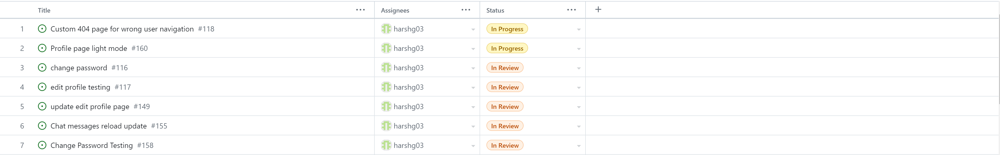

## Individual log Harsh Gill 

### Work period
- Sept.25, 2023 - Oct.1, 2023

### Tasks worked on

### Weekly goal recap
- My goals for this week were to complete the project plan with our group and get more familiar with the tech stack that we are using.
- Goals for next week are to review javascript, CSS, and HTML for the frontend and review/learn python for the backend, also get more familiar with
the tech stack.

### Tasks on board

My associated tasks on the board are project plan #3 and Docker setup and installation #2.

### Completed vs. in progress
Completed tasks this week for me were just project plan #3, and in-progress tasks are just the Docker setup and installation.

## Week 5

### Work period
- Oct.2, 2023 - Oct.8, 2023

### Tasks worked on

### Weekly goal recap
- My goals for this week were to learn the Django framework and review Python, and front-end coding
- Goals for next week are to continue to get more familiar with Django and get started working on 
our login/signup feature for the milestone.

### Tasks on board

### Completed vs in progress
- The in-progress task this week is just #12, learning the Django framework and reviewing front-end and Python; I had no completed tasks this week.

## Week 6/7

### Work period
- Oct.9, 2023 - Oct.22, 2023

### Tasks worked on

### Weekly goal recap
- My goals for these two weeks were to review and test the Django login/logout and sign-up authentication system.
As well as test the views and URLs for our website.
- My goals for next week are to help our group complete documentation regarding our two features, prepare for the presentation and start working on features for the second milestone.

### Tasks on board

### Completed vs in progress
- I just had one task this week, which was task #19, and it is completed.

## Week 8

### Work period
- Oct.23, 2023 - Oct.29, 2023

### Tasks worked on

### Weekly goal recap

- My goals for this week were to work on testing and start working on my features for the next milestone.

- My goals for next week are to be prepared for our group's live demo, finish up on the testing, and work on account
recovery feature.

### Tasks on board

### Completed vs in progress

- I had two tasks this week, tasks #38 and #39, and both are in progress.

## Week 9

### Work period
- Oct.30, 2023 - Nov.5, 2023

### Tasks worked on

### Weekly goal recap

- My goals for this week were to finish testing and start working on my features for the next milestone, also
to be prepared for our group's live demo.

- My goals for next week are to finish the account recovery feature and try to finish the testing
for that as well.

### Tasks on board

### Completed vs in progress

- I had two tasks this week, tasks #38 and #39, task #39 is in progress and 
task #38 student/teacher role testing is complete.

## Week 10

### Work period
- Nov.6, 2023 - Nov.12, 2023

### Tasks worked on

### Weekly goal recap

- My goals for this week were to finish the account recovery feature and start the testing on it. So far, the feature itself is functional.
The templates for the feature, however, need some adjustments.

- My goals for next week are to finish the account recovery feature, complete the testing, and start working on my second feature.

### Tasks on board

### Completed vs in progress

- I had one task this week task #39, and it is in progress.

## Week 12

### Work period
- Nov.20, 2023 - Nov.26, 2023

### Tasks worked on

### Weekly goal recap

- My goals for this week were to finish the account recovery feature and start working on the rate limit feature.

- My goals for next week are to finish the rate limit feature and help my group complete the rest of the design milestone.

### Tasks on board

### Completed vs in progress

- task #39 account recovery (forgot password) is complete
- task #65 rate limit is in progress

## Week 13

### Work period
- Nov.27, 2023 - Dec.3, 2023

### Tasks worked on

### Weekly goal recap

- My goals for this week were to finish the rate limiting feature (done for login and password reset) and get some testing done for the 
account recovery and rate limiting feature. I also helped our group finish the design milestone as well. 

### Tasks on board

### Completed vs in progress

- Task #76 Account recovery testing is complete
- Task #74 Rate limit testing is in review (complete for login and reset password)
- Task #65 Rate limit is in review (complete for login and reset password)

## Week 1 Term 2

### Work period
- Jan.8, 2024 - Jan.14, 2024

### Tasks worked on

### Weekly goal recap

- My goal this week was to help my group plan out our remaining features so we could start working on our features next week.

### Tasks on board

### Completed vs in progress

- #66 Help/Faq page -> harshg03 is in progress

### Branch worked on

- I worked on the faq branch: https://github.com/COSC-499-W2023/year-long-project-team-17/tree/faq. The latest and only commit I have is in week 3 "Finished faq and contact page and added testing" as I didn't know at the time about creating draft PR's and adding your work to them.

## Week 2 Term 2

### Work period
- Jan.15, 2024 - Jan.21, 2024

### Tasks worked on

### Weekly goal recap

- My goal this week was to work on my faq/help page feature for the upcoming peer testing milestone.

### Tasks on board

### Completed vs in progress

- #66 Help/Faq page -> harshg03 is in progress

### Branch worked on

- I worked on the faq branch: https://github.com/COSC-499-W2023/year-long-project-team-17/tree/faq. The latest and only commit I have is in week 3 "Finished faq and contact page and added testing" as I didn't know at the time about creating draft PR's and adding your work to them.

## Week 3 Term 2

### Work period
- Jan.22, 2024 - Jan.28, 2024

### Tasks worked on

### Weekly goal recap

- My goal this week was to finish the faq/contact page and add testing for the contact page, I also added more testing for the views and
URLs.

### Tasks on board

### Completed vs in progress

- #66 Help/Faq page -> harshg03 is complete
- #88 update testing on views and URLs -> harshg03 is complete
- #87 testing for contact and faq page -> harshg03 is complete

## Week 4 Term 2

### Work period
- Jan.29, 2024 - Feb.04, 2024

### Tasks worked on

### Weekly goal recap

- My goal this week was to help create the tasks for the heuristic evaluation and help prepare our prototype for peer testing #1.

### Tasks on board

- I did not have any of my own tasks this week to work on, but I did help create the tasks for the heuristic evaluation in peer testing #1. I do plan on meeting
with my group soon and going over our notes on peer testing #1 to decide what needs to be added or fixed in our prototype.

### Completed vs in progress

- I did not have any of my own tasks this week to work on, but I did help create the tasks for the heuristic evaluation in peer testing #1. I do plan on meeting
with my group soon and going over our notes on peer testing #1 to decide what needs to be added or fixed in our prototype.

## Week 5 Term 2

### Work period
- Feb.05, 2024 - Feb.11, 2024

### Tasks worked on

### Weekly goal recap

- My goal this week was to work on storing the presentations that get generated for users.

### Tasks on board

### Completed vs in progress

- #111 Presentation Storage -> harshg03 in review

## Week 6 Term 2

### Work period
- Feb.12, 2024 - Feb.18, 2024

### Tasks worked on

### Weekly goal recap

- My goal this week was to start work on creating a profile page and listing the user's presentations on the profile page.

### Tasks on board

### Completed vs in progress

- #111 Presentation Storage -> harshg03 is completed
- #115 Profile/list user's own presentations -> harshg03 in progress
- #116 change password -> harshg03 in progress
- #117 edit profile testing -> harshg03 in progress

## Week 8 Term 2

### Work period
- Feb.26, 2024 - March.3, 2024

### Tasks worked on

### Weekly goal recap

- My goal this week was to finish my features for the upcoming peer testing #2 milestone.

### Tasks on board

### Completed vs in progress

- #115 Profile/list user's own presentations -> harshg03 in review
- #116 change password -> harshg03  in progress
- #117 edit profile testing -> harshg03 in progress
- #118 Custom 404 page for wrong user navigation -> harshg03 in progress
- #132 Change presentation storage -> harshg03 in review

## Week 9 Term 2

### Work period
- March.4, 2024 - March.10, 2024

### Tasks worked on

### Weekly goal recap

- My goal this week was to finish my features and help prepare the tasks for the #2 peer testing milestone.

### Tasks on board

### Completed vs in progress

- #115 Profile/list user's own presentations -> harshg03 is completed
- #116 change password -> harshg03  in progress
- #117 edit profile testing -> harshg03 in progress
- #118 Custom 404 page for wrong user navigation -> harshg03 in progress
- #132 Change presentation storage -> harshg03 is completed

## Week 10 Term 2

### Work period
- March.11, 2024 - March.17, 2024

### Tasks worked on

### Weekly goal recap

- My goal this week was to work on updating the edit profile page to include profile information such as profile picture,
adding a change password page and testing.

### Tasks on board

### Completed vs in progress

- #116 change password -> harshg03  in progress
- #117 edit profile testing -> harshg03 in progress
- #118 Custom 404 page for wrong user navigation -> harshg03 in progress
- #149 Update edit profile page -> harshg03 in progress

## Week 11 Term 2

### Work period
- March.18, 2024 - March.24, 2024

### Tasks worked on

### Weekly goal recap

- My goal this week was to finish updating the edit profile, complete change password, and finish testing on them. 

### Tasks on board

### Completed vs in progress

- #116 change password -> harshg03  in review
- #117 edit profile testing -> harshg03 in review
- #118 Custom 404 page for wrong user navigation -> harshg03 in progress
- #149 Update edit profile page -> harshg03 in review
- #155 Chat messages reload update -> harshg03 in review
- #158 Change password testing -> harshg03 in review

## Week 12 Term 2

### Work period
- March.25, 2024 - March.31, 2024

### Tasks worked on

### Weekly goal recap

- My goal this week was to work on light mode for the profile page and the 404 page. 

### Tasks on board

### Completed vs in progress

- #116 change password -> in review
- #117 edit profile testing -> in review
- #118 Custom 404 page for wrong user navigation -> in progress
- #149 Update edit profile page -> in review
- #155 Chat messages reload update -> in review
- #158 Change password testing -> in review
- #160 Profile page light mode -> in progress

## Week 13 Term 2

### Work period
- April.1, 2024 - April.7, 2024

### Tasks worked on

### Weekly goal recap

- My goal this week was to complete everything I was working on and
finish my individual report. 

### Tasks on board

### Completed vs in progress

- #116 change password -> completed
- #117 edit profile testing -> completed
- #149 Update edit profile page -> completed
- #155 Chat messages reload update -> completed
- #158 Change password testing -> completed
- #160 Profile page light mode -> completed
- #179 Updated testing -> harshg03 -> complete
