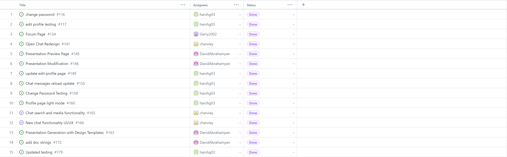

# Team 17

## Work performed

April.1, 2024 - April.7, 2024

Meeting

Coding

Testing

Documentation

Review

## Team members

harshg03 -> Harsh Gill

Gerry2002 -> Gerard Escolano

DavidAbrahamyan -> Davit Abrahamyan

charviey -> Charvie Yadav

## Milestone goals recap

- Our team's goal this week was to complete our remaining features and individual project reports.       

## Associated board tasks

## Completed tasks
 
- #116 Change password -> harshg03 
- #117 Edit profile testing -> harshg03
- #134 Forum page -> Gerry2002
- #141 Open Chat Redesign -> charviey 
- #145 Presentation Preview Page -> DavidAbrahamyan 
- #146 Presentation Modification -> DavidAbrahamyan
- #149 Update edit profile page -> harshg03 
- #155 Chat messages reload update -> harshg03
- #158 Change password testing -> harshg03 
- #160 Profile page light mode -> harshg03
- #163 Presentation Generation with Design Templates -> DavidAbrahamyan 
- #165 Chat search and media functionality -> charviey
- #166 New Chat functionality UI/UX -> charviey
- #172 Add doc strings -> DavidAbrahamyan
- #179 Updated testing -> harshg03

## Burnup chart

## Test report

