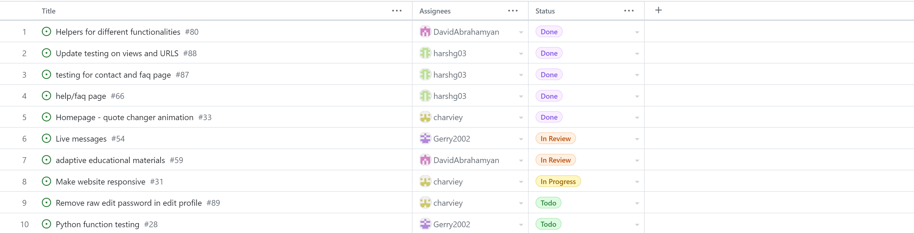
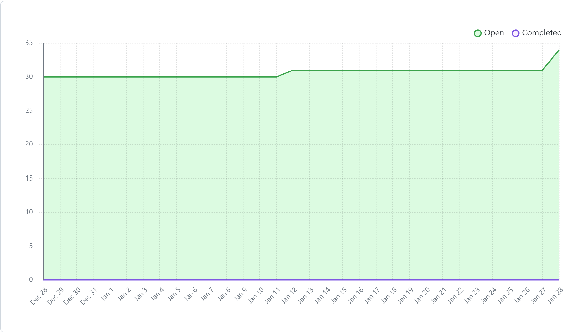

# Team 17

## Work performed

Jan.22, 2024 - Jan.28, 2024

Meeting

Coding

testing

review

## Team members

harshg03 -> Harsh Gill

Gerry2002 -> Gerard Escolano

DavidAbrahamyan -> Davit Abrahamyan

charviey -> Charvie Yadav

## Milestone goals recap

- Our team's goal this week was to finish the features we have for the peer testing #1. 

## Associated board tasks

## Completed tasks
 
- #33 Homepage quoter changer animation -> charviey  
- #54 Live messages -> gerry2002 in review
- #59 adaptive educational materials -> DavidAbrahamyan in review
- #66 Help/Faq page -> harshg03
- #80 Helpers for different functionalities -> DavidAbrahamyan  
- #87 testing for contact and faq page -> harshg03
- #88 Update testing for views and URLs -> harshg03

## In progress tasks

- #31 Make website responsive -> charviey

## Burnup chart

## Test report

 
