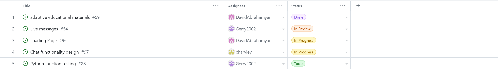
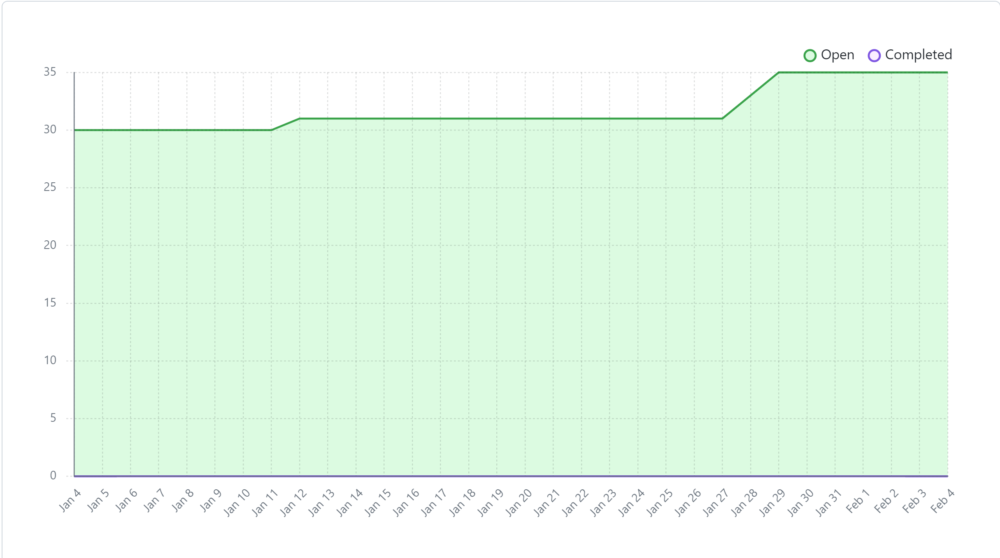

# Team 17

## Work performed

Jan.29, 2024 - Feb.04, 2024

Meeting

Coding

planning

review

## Team members

harshg03 -> Harsh Gill

Gerry2002 -> Gerard Escolano

DavidAbrahamyan -> Davit Abrahamyan

charviey -> Charvie Yadav

## Milestone goals recap

- Our team's goal this week was to have our tasks and prototype ready for peer testing #1 and work
on our features.                  

## Associated board tasks

## Completed tasks
 
- #54 Live messages -> gerry2002 in review
- #59 adaptive educational materials -> DavidAbrahamyan 

## In progress tasks

- #96 Loading page -> DavidAbrahamyan
- #97 Chat functionality design -> charviey

## Burnup chart

## Test report

 
