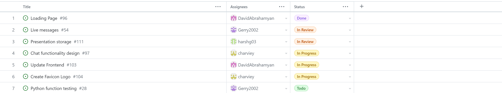
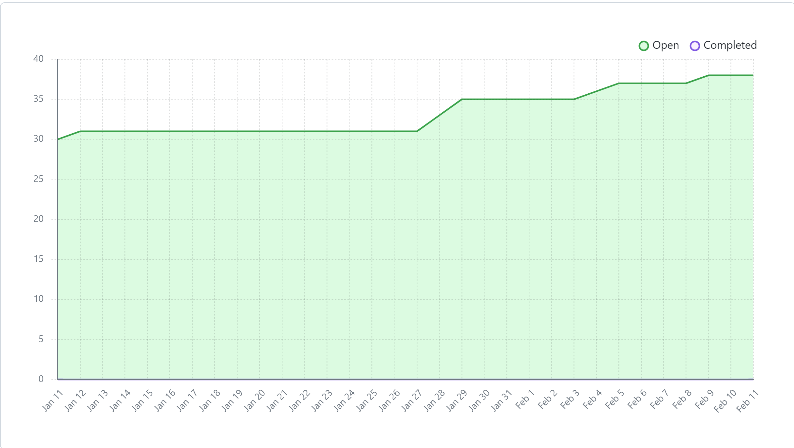

# Team 17

## Work performed

Feb.05, 2024 - Feb.11, 2024

Meeting

Coding

planning

review

## Team members

harshg03 -> Harsh Gill

Gerry2002 -> Gerard Escolano

DavidAbrahamyan -> Davit Abrahamyan

charviey -> Charvie Yadav

## Milestone goals recap

- Our team's goal this week was to start working on our features for the peer testing #2 milestone.           

## Associated board tasks

## Completed tasks
 
- #54 Live messages -> gerry2002 in review
- #96 Loading page -> DavidAbrahamyan
- #111 Presentation storage -> harshg03 in review

## In progress tasks

- #97 Chat functionality design -> charviey
- #103 Update frontend -> DavidAbrahamyan
- #104 Create favicon logo -> charviey

## Burnup chart

## Test report

 
