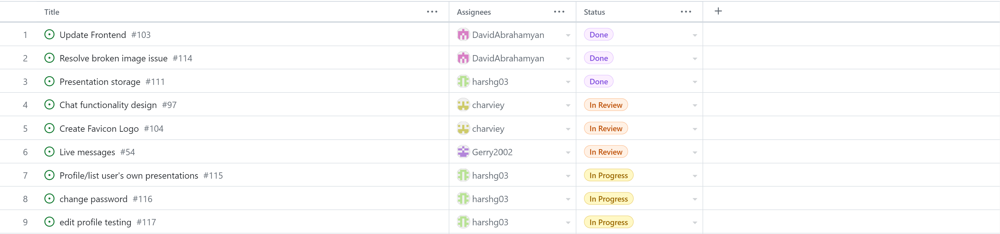
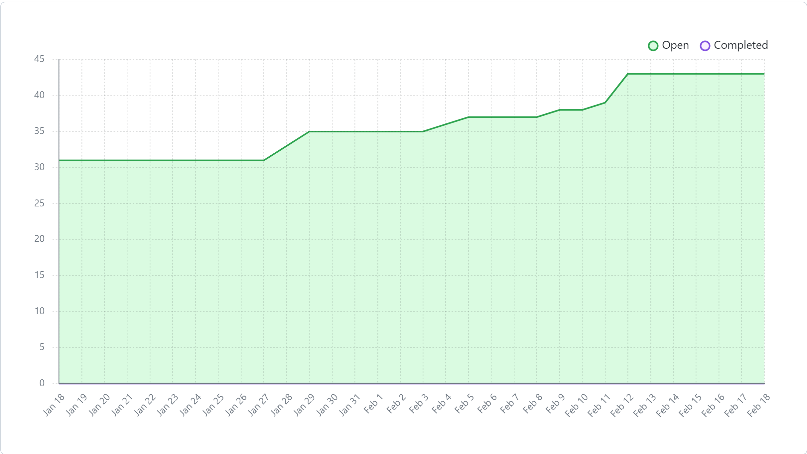
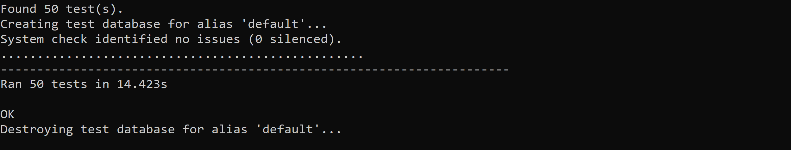

# Team 17

## Work performed

Feb.12, 2024 - Feb.18, 2024

Meeting

Coding

review

## Team members

harshg03 -> Harsh Gill

Gerry2002 -> Gerard Escolano

DavidAbrahamyan -> Davit Abrahamyan

charviey -> Charvie Yadav

## Milestone goals recap

- Our team's goal this week was to continue working on our features for the peer testing #2 milestone.           

## Associated board tasks

## Completed tasks
 
- #97 Chat functionality design -> charviey in review
- #103 Update Frontend -> DavidAbrahamyan
- #104 Create favicon logo -> charviey in review
- #111 Presentation storage -> harshg03 
- #114 Resolve broken image issue -> DavidAbrahamyan

## In progress tasks

- #115 Profile/list user's own presentations -> harshg03 in progress
- #116 change password -> harshg03 in progress
- #117 edit profile testing -> harshg03 in progress

## Burnup chart

## Test report

 
