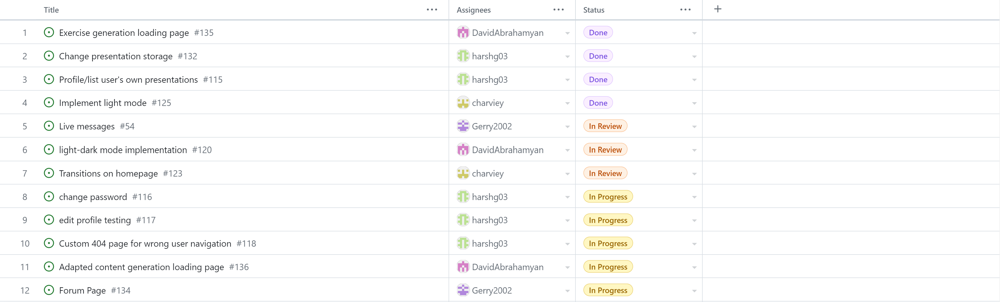
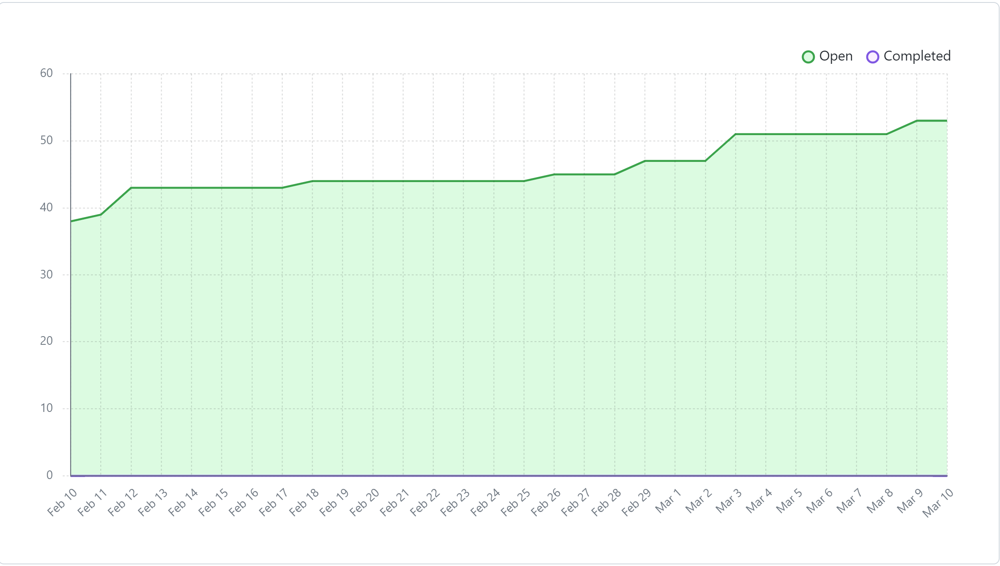

# Team 17

## Work performed

March.4, 2024 - March.10, 2024

Meeting

Coding

Review

## Team members

harshg03 -> Harsh Gill

Gerry2002 -> Gerard Escolano

DavidAbrahamyan -> Davit Abrahamyan

charviey -> Charvie Yadav

## Milestone goals recap

- Our team's goal this week was to finish up our features and have our tasks ready for the #2 peer testing milestone.        

## Associated board tasks

## Completed tasks
 
- #115 Profile/list user's own presentations -> harshg03
- #120 light-dark mode implementation -> DavidAbrahamyan in review
- #123 Transitions on homepage -> charviey in review
- #125 implement light mode -> charviey 
- #132 Change presentation storage -> harshg03
- #135 Exercise generation loading page -> DavidAbrahamyan

## In progress tasks

- #116 change password -> harshg03
- #117 edit profile testing -> harshg03 
- #118 Custom 404 page for wrong user navigation -> harshg03
- #134 Forum page -> Gerry2002
- #136 Adapted content generation loading page -> DavidAbrahamyan

## Burnup chart

## Test report

 
