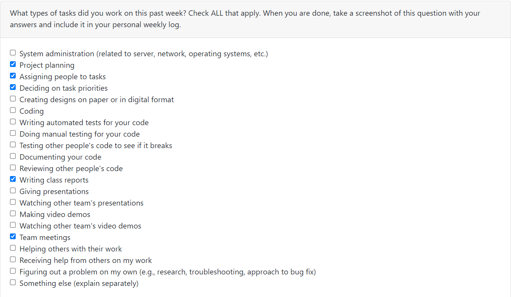
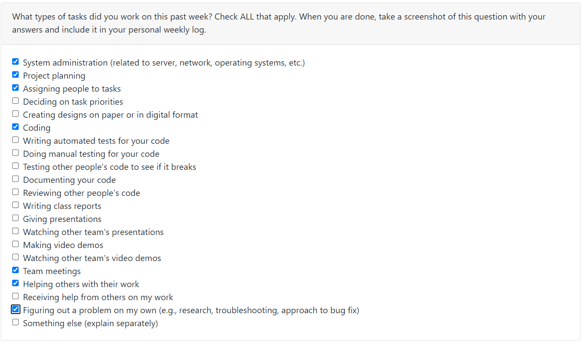
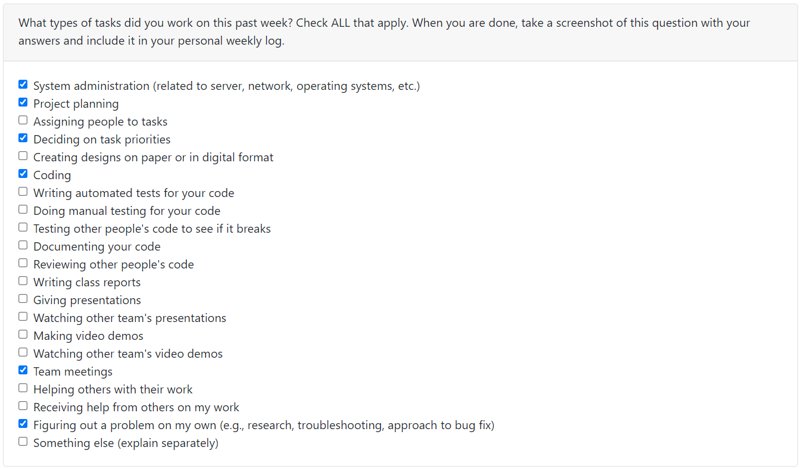

# Gerard Individual Logs

## Week4 (Sept.25, 2023 - Oct.1, 2023)
### Goals Recap
- My goals this week was to complete the team project plan, and from the tech stack decided, start downloading and setting up my system as soon as possible, in order to be able to start working on other features. 
### Tasks on board
- This week I helped finish the project plan, I completed the project overview and as a team we all worked on the features that would be present in the project. I also started downloading the required softwares and started setting up my system.

### Completed vs InProgress
- The project plan is completed but the system set up is still in progress.

### Context
I believe this week helped us familiarize with how the project will advance and the priorities that we will have

### Peer eval

# Gerard Individual Logs

## Week5 (Oct.2, 2023 - Oct.8, 2023)
### Goals Recap
- My goals these week were focused on learning the web framework django. And having set up everyones system so that everyone can work efficiently using github. I learned a lot about Django, but I believe that the systems will still need some work as I only know that two of our systems work.
### Tasks on board
- My tasks are the login, logout and auth for the website and learning django. I already created a fully functioning login, logout and registration system that will be the base for our project using Django.

### Completed vs InProgress
- Login, logout and auth task still needs some work to be completely finished, but learning Django has been completed

### Context
I believe this week was really stressfull, as I believed that my team knew which framework we were gonna use, and I could just jump in from that, as I have no knowledge in web programming, but apparently they had no idea so I had to decide on which one we were going to use and learn it from zero.

### Peer eval

## Week6 (Oct.9, 2023 - Oct.15, 2023)
### Goals Recap
- My goals this week was to focus on the testing for the python functionalities coded by Davit. But on thusday we realized that we had to work on the feature that diferentiates the type of users, so I decided to do that instead. I did manage to finish that, which has to be implemented as we move forward.
### Tasks on board
- My task was changed into the student/teacher differentiation as this was required for the plan that we want for the web application. Also we need to have an idea on how it works so it can be implemented as different features are added

### Completed vs InProgress
- Python testing is still a task that I need to complete so it is still in progress, and the student/teacher differentiation is complete but not yet pushed to the main

### Context

### Peer eval

