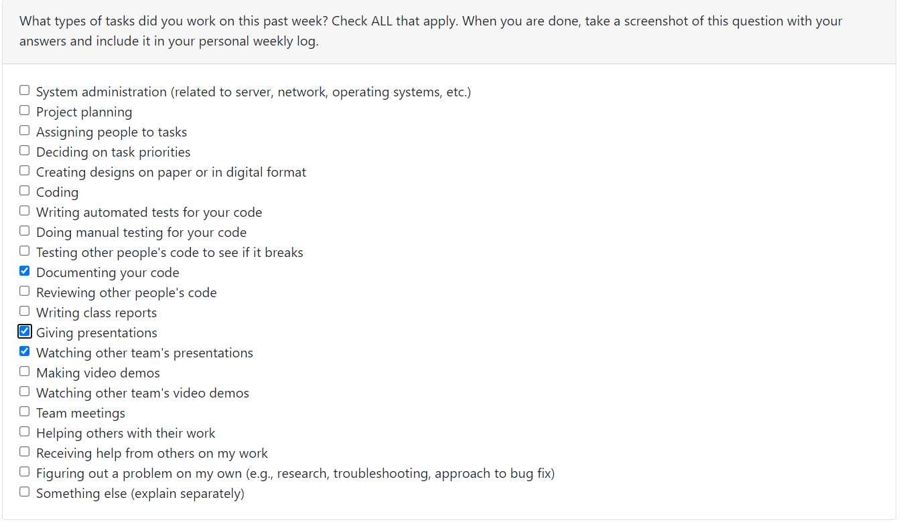

# Gerard Individual Logs

## Week4 (Sept.25, 2023 - Oct.1, 2023)
### Goals Recap
- My goals this week was to complete the team project plan, and from the tech stack decided, start downloading and setting up my system as soon as possible, in order to be able to start working on other features. 
### Tasks on board
- This week I helped finish the project plan, I completed the project overview and as a team we all worked on the features that would be present in the project. I also started downloading the required softwares and started setting up my system.

### Completed vs InProgress
- The project plan is completed but the system set up is still in progress.

### Context
I believe this week helped us familiarize with how the project will advance and the priorities that we will have

### Peer eval

## Week5 (Oct.2, 2023 - Oct.8, 2023)
### Goals Recap
- My goals these week were focused on learning the web framework django. And having set up everyones system so that everyone can work efficiently using github. I learned a lot about Django, but I believe that the systems will still need some work as I only know that two of our systems work.
### Tasks on board
- My tasks are the login, logout and auth for the website and learning django. I already created a fully functioning login, logout and registration system that will be the base for our project using Django.

### Completed vs InProgress
- Login, logout and auth task still needs some work to be completely finished, but learning Django has been completed

### Context
I believe this week was really stressfull, as I believed that my team knew which framework we were gonna use, and I could just jump in from that, as I have no knowledge in web programming, but apparently they had no idea so I had to decide on which one we were going to use and learn it from zero.

### Peer eval

## Week6 (Oct.9, 2023 - Oct.15, 2023)
### Goals Recap
- My goals this week was to focus on the testing for the python functionalities coded by Davit. But on thusday we realized that we had to work on the feature that diferentiates the type of users, so I decided to do that instead. I did manage to finish that, which has to be implemented as we move forward.
### Tasks on board
- My task was changed into the student/teacher differentiation as this was required for the plan that we want for the web application. Also we need to have an idea on how it works so it can be implemented as different features are added

### Completed vs InProgress
- Python testing is still a task that I need to complete so it is still in progress, and the student/teacher differentiation is complete but not yet pushed to the main

### Context

### Peer eval

## Week7 (Oct.16, 2023 - Oct.22, 2023)
### Goals Recap
- My focus this week was to get everything pushed into the master branch of the poject so we could have everything already up to date for the presentation.
### Tasks on board
- My task on board is still to create the testing for multiple python functions, and this is because for the past week I did not manage to finish it

### Completed vs InProgress
- Python testing is still a task that I need to complete so it is still in progress. But now our progress is on the main, which took some time because of merge conflicts.

### Context
This was a week in which I did not do as much as previous weeks as I had to study for midterms.

### Peer eval
There is no week7 Peer eval, so I used the same from last week.

## Week8 (Oct.23, 2023 - Oct.29, 2023)
### Goals Recap
- My goal this week stayed the same, getting all of the updates and pull requests merged into the master to show what we have in the presentation. Also planned which parts of the website we will be sharing in the presentation
### Tasks on board
- My task on board is still to create the testing for multiple python functions, and this is because I have nt worked on it untill we have everything for the presentation ready.

### Completed vs InProgress
- Python testing is still a task that I need to complete so it is still in progress. But now our progress is on the main, which took some time because of merge conflicts.(Same as last week)

### Context
This was a slow week as we are mostly figuring out the things that are needed for the presentation and we dont want to have any problems whith the live presentation

### Peer eval

## Week9 (Oct.30, 2023 - Nov.5, 2023)
### Goals Recap
- This week the goal was to have a fully functional live demo for the presentation and deciding which features we would show

### Tasks on board
- My task on board is still to create the testing for multiple python functions

### Completed vs InProgress
- Python testing is still a task that I need to complete so it is still in progress. But now our progress is on the main, which took some time because of merge conflicts.(Same as last week)

### Context
This week I did not have any advancement in features as I was focused on the live demo

### Peer eval

## Week10 (Nov. 6, 2023 - Nov. 12, 2023)
### Goals Recap
- This week the goal was to move forward with deciding which feature everyone is gonna work on, and start coding it.

### Tasks on board
- This week my tasks on board changed. I moved back function testing and took on two different tasks. Implementing different colored messages and a live messaging system

### Completed vs InProgress
- I have completed the different colored toast messages depending on the type of information being shown. And I will start working on the implementation of live messages over the following weeks.

### Context
- The messages took priority as these were comments from the presentation given in the previous week.

### Peer eval

## Week11 (Nov. 13, 2023 - Nov. 19, 2023)
### Goals Recap
- During the break I started working on the messaging implementation for the application

### Tasks on board
- The only task on board is the live messaging functionality

### Completed vs InProgress
- Live messaging functionality is still in progress

### Context
- Advances were made in database model and django that can be used for live messaging

### Peer eval

## Week12 (Nov. 20, 2023 - Nov. 26, 2023)
### Goals Recap
- This week my focus was to keep going with a functional live chat

### Tasks on board
- Same as last week live chatting is my only task on board

### Completed vs InProgress
- Live chatting is InProgress

### Context
- Messaging different users is working, but at this time the messaging functionality is being done with the database, but its not fully functional for live messaging. Therefore I am still working on getting ports to work, but this seems to be larger topic than expected and I may need to come up with a different approach to make it functional.

### Peer eval

## Week13 (Nov. 27, 2023 - Dec, 3, 2023)
### Goals Recap
- This week I worked on getting the design document and on the testing for the messaging

### Tasks on board
- Live chatting is still my task on the board, this is because I want to make it work with ports before moving on

### Completed vs InProgress
- Live chatting is InProgress

### Context
- Focused on the design document getting completed and completing testing for the messaging

### Peer eval

# Term 2

## Week1 (Jan 8, 2023 - Jan 14, 2023)
### Goals Recap
- We just came back from winter break so this weeks goal was to chck up on the team and see the objective for the upcoming weeks

### Tasks on board
- Live chatting is still my task on the board, this is because I did not work on it over the break and there is still a lot to improve in the feature

### Completed vs InProgress
- Live chatting is InProgress

### Context
- I did not work on the project over the break, and this initial week has was used to get up to date with the team and back into rythm.
- Branch Link https://github.com/COSC-499-W2023/year-long-project-team-17/tree/directMessaging

### Peer eval

## Week2 (Jan 15, 2023 - Jan 21, 2023)
### Goals Recap
- This week my goal was to focus on the front end of the chat website. I have not completed it

### Tasks on board
- Live chatting is still my task on the board, this is still my task, as now I have worked on the front end

### Completed vs InProgress
- Live chatting is InProgress

### Context
- I tried to work on the front end, but decided to work on the backend to improve the functionality of the live chatting, but yet none of the options worked as expected
- Branch Link https://github.com/COSC-499-W2023/year-long-project-team-17/tree/liveChatTry2

### Peer eval

## Week3 (Jan 22, 2023 - Jan 28, 2023)
### Goals Recap
- My goal this week was to create the front end of the chat feature. I completed it

### Tasks on board
- Live chatting is still my task on the board, this is because there are still things to be done in this task

### Completed vs InProgress
- Live chatting is InProgress

### Context
- Completed the backend for the chating rooms, completed simple front end for chatting rooms, now working on completing front and backend for the current open chats for each user.
- Branch Link https://github.com/COSC-499-W2023/year-long-project-team-17/tree/liveChatTry2

### Peer eval

## Week4 (Jan 29, 2023 - Feb 04, 2023)
### Goals Recap
- My goal this week was to work on the open chats function to show the user the chats they have open. Another goal which I was unable to complete was the create a new chat with a different user

### Tasks on board
- Live chatting is still my task on the board, this is because there are still things to be done in this task

### Completed vs InProgress
- Live chatting is InProgress

### Context
- Completed backend for chat function along with opened chats function. Still trying to figure out a better way to improve live chatting
- Branch Link https://github.com/COSC-499-W2023/year-long-project-team-17/tree/liveChatTry2

### Peer eval

