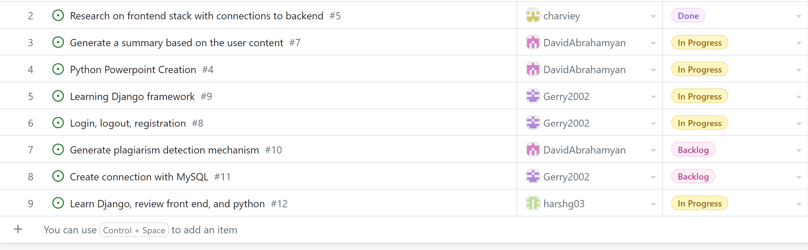

# Team 17

## Work performed

Oct.2, 2023 - Oct.8, 2023

Development environment setup

Learning

Review

## Team members

harshg03 -> Harsh Gill

Gerry2002 -> Gerard Escolano

DavidAbrahamyan -> Davit Abrahamyan

charviey -> Charvie Yadav

## Milestone goals recap
- Our team's goals this week were to learn the Django framework and review concepts such as the front end in order to get more accustomed
  to the tech stack. We also started to get our project's development environment set up this week.

## Associated board tasks

## Completed tasks

- #5 Research on frontend stack with connections to backend -> charviey

## In progress tasks

- #4 Python Powerpoint Creation -> DavidAbrahamyan
- #7 Generate a summary based on the user content -> DavidAbrahamyan
- #8 Login, logout, registration -> Gerry2002
- #9 Learning Django framework -> Gerry2002
- #12 Learn Django, review front end, and python -> harshg03, charviey

## Burnup chart

## Test report
- This week, there was no coding done, so there is no test report.

