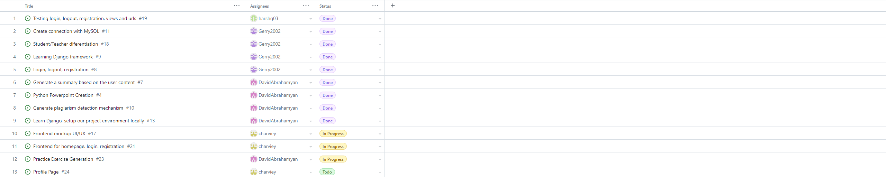
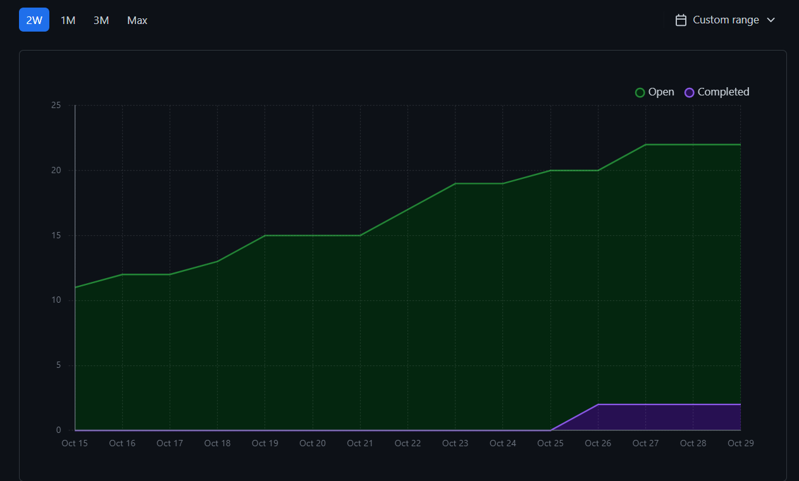
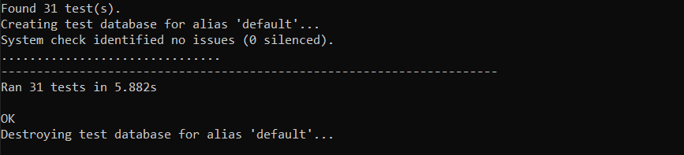

# Team 17

## Work performed

Oct.9, 2023 - Oct.22, 2023

Coding

Testing

Learning

Review

## Team members

harshg03 -> Harsh Gill

Gerry2002 -> Gerard Escolano

DavidAbrahamyan -> Davit Abrahamyan

charviey -> Charvie Yadav

## Milestone goals recap

- Our team's goal these two weeks was to work on our two features for the milestone, which were
the login, logout, and registration system and generating a summary based on the user content

- So far, both features are functional, and testing is completed for the login, logout and registration
system. Testing is to be completed for the summary generation feature as well as the documentation for both features.

## Associated board tasks

## Completed tasks

- #4 Python Powerpoint Creation -> DavidAbrahamyan
- #7 Generate a summary based on the user content -> DavidAbrahamyan
- #8 Login, logout, registration -> Gerry2002
- #9 Learning Django framework -> DavidAbrahamyan
- #10 Generate plagiarism detection mechanism -> DavidAbrahamyan
- #11 Create connection with MySQL -> Gerry2002
- #13 Learn Django, setup our project environment locally -> DavidAbrahamyan
- #18 Student/Teacher differentiation -> Gerry2002
- #19 Testing login, logout, registrations, views and URLs -> harshg03

## In progress tasks

- #17 Frontend mockup UI/UX #17 -> charviey
- #21 Frontend for homepage, login, registration -> charviey
- #23 Practice exercise generation -> DavidAbrahamyan

## Burnup chart

## Test report

 
