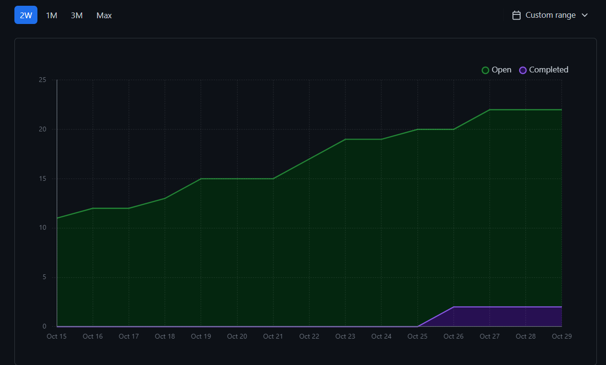

# Team 17

## Work performed

Oct.23, 2023 - Oct.29, 2023

Coding

Testing

## Team members

harshg03 -> Harsh Gill

Gerry2002 -> Gerard Escolano

DavidAbrahamyan -> Davit Abrahamyan

charviey -> Charvie Yadav

## Milestone goals recap

- Our team's goal this week was to improve our frontend look for our website and start testing
for our second feature for the milestone.

- The testing and frontend improvement is still in progress.

## Associated board tasks

## Completed tasks

- #21 Frontend for homepage, login, registration -> charviey
- #24 Profile Page -> charviey 

## In progress tasks

- #23 Practice excercise generation -> DavidAbrahamyan
- #26 Generate virtual assistant (chatbot) for the website -> DavidAbrahamyan
- #28 Python function testing -> Gerry2002
- #31 Make website responsive -> charviey
- #38 Django student/teacher role testing -> harshg03
- #39 Account recovery -> harshg03

## Burnup chart

## Test report

 
