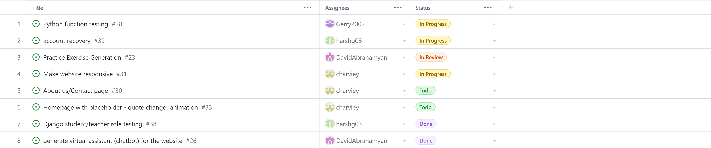
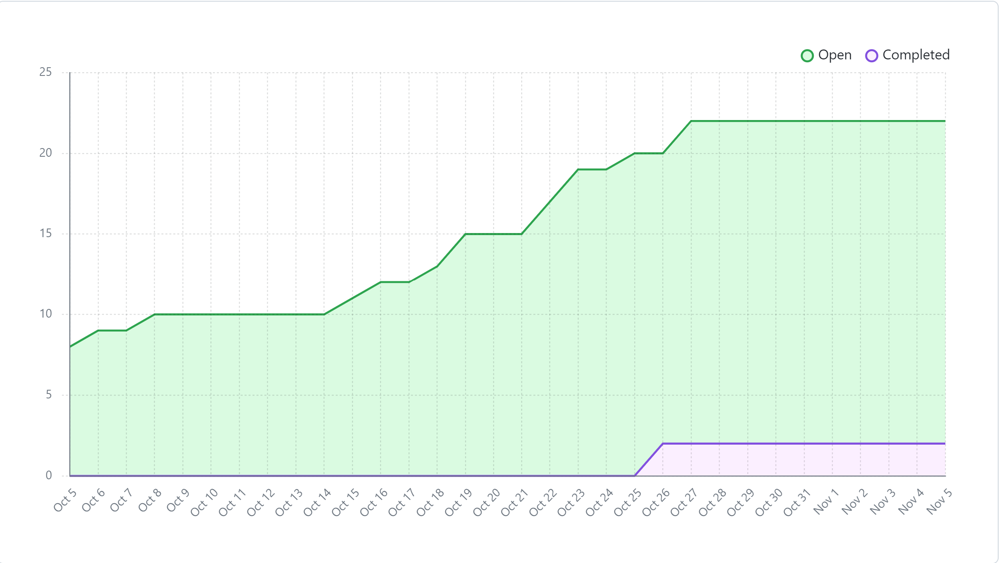
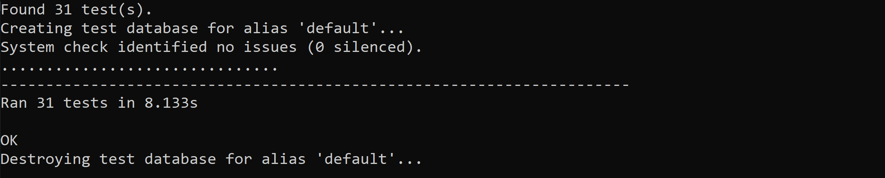

# Team 17

## Work performed

Oct.30, 2023 - Nov.5, 2023

Coding

Testing

Demo

## Team members

harshg03 -> Harsh Gill

Gerry2002 -> Gerard Escolano

DavidAbrahamyan -> Davit Abrahamyan

charviey -> Charvie Yadav

## Milestone goals recap

- Our team's goal this week was to improve upon the front end, ensure that our website and
  its features were functioning correctly and practice for the live demo.

## Associated board tasks

## Completed tasks

- #26 Generate virtual assistant (chatbot) for the website -> DavidAbrahamyan
- #38 Django student/teacher role testing -> harshg03

## In progress tasks

- #23 Practice excercise generation -> DavidAbrahamyan
- #28 Python function testing -> Gerry2002
- #31 Make website responsive -> charviey
- #30 About Us/Contact Page -> charviey
- #39 Account recovery -> harshg03

## Burnup chart

## Test report

 
